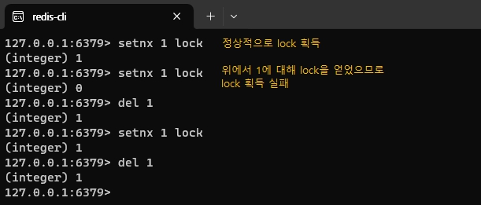
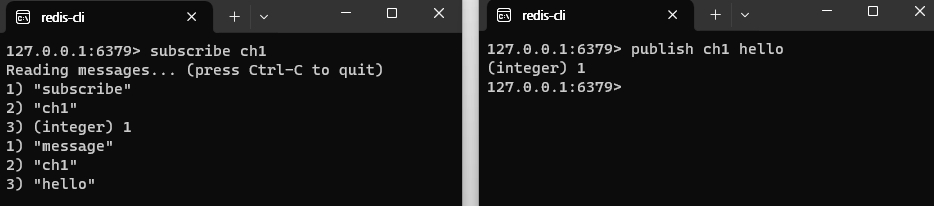

# 동시성 이슈 해결하기

인프런에서 [재고 시스템으로 알아보는 동시성 이슈 해결 방법](https://www.inflearn.com/course/%EB%8F%99%EC%8B%9C%EC%84%B1%EC%9D%B4%EC%8A%88-%EC%9E%AC%EA%B3%A0%EC%8B%9C%EC%8A%A4%ED%85%9C/dashboard) 강의를 들으며 정리한 내용이다. <br/>

문제 발생 상황은 master 브랜치에, 각각의 해결 과정은 새로운 브랜치에 정리하였다.
- [동시성 이슈 발생](https://github.com/develop-hani/Stock_concurrency_issue/tree/master)
- [Java의 synchronized로 해결](https://github.com/develop-hani/Stock_concurrency_issue/tree/synchronized)
- [Database의 Lock으로 해결](https://github.com/develop-hani/Stock_concurrency_issue/tree/database)
  - [Pessimistic Lock 적용](https://github.com/develop-hani/Stock_concurrency_issue/tree/8da6ce7917b0d3d160c7ceb972382061a2cd87ca)
  - [Optimistic Lock 적용](https://github.com/develop-hani/Stock_concurrency_issue/tree/02032b206d009104a6646ee3332be401a82cf25a)
  - [Named Lock 적용](https://github.com/develop-hani/Stock_concurrency_issue/tree/20ddb2299a027f10b6a547aa193e8355ee62ef01)

## ♾️ 해결 방법 3: Redis
### 🎤 대표적인 라이브러리
1. **Lettuce**
  - `setnx`(set if not exist) 명령어를 활용하여 분산락 구현
    - key와 value를 set할 때, 기존의 값이 없을 때만 set을 진행
  - spin lock 방식
    - lock을 획득하려는 thread가 lock을 사용할 수 있는지 반복적으로 확인하면서 lock을 획득
    - retry 로직을 개발자가 작성
  

2. **Redisson**
   - pub-sub 기반의 lock 기반
     - 채널을 하나 만들고 락을 점유 중인 thread가 락을 획득하려고 대기 중인 thread에게 해제를 알려줌
     - lettuce와 다르게 락 획득 로직을 개발자가 작성할 필요 없음

### 🥬 Lettuce
Lettuce을 적용한 코드는 [이곳](https://github.com/develop-hani/Stock_concurrency_issue/tree/260cc09900b48b3bacdf60471615e971af6e46c2)에서 확인할 수 있다.
1. Redis dependency 추가 </br>
    `implementation 'org.springframework.boot:spring-boot-starter-data-redis'`
2. redis 명령어를 확용하기 위한 redis repository 생성
    ```java
    public Boolean lock(Long key) {
        return redisTemplate
                .opsForValue()
                .setIfAbsent(generateKey(key), "lock", Duration.ofMillis(3_000));
    }

    public Boolean unlock(Long key) {
        return redisTemplate
                .delete(generateKey(key));
    }

    private String generateKey(Long key) {
        return key.toString();
    }
    ```
3. lock 획득과 해제를 위한 facade 정의
    ```java
    public void decrease(Long id, Long quantity) throws InterruptedException {
        while (!redisLockRepository.lock(id)) {
            Thread.sleep(100);
        }

        try {
            stockService.decreaseStock(id, quantity);
        } finally {
            redisLockRepository.unlock(id);
        }
    }
    ```

#### Lettuce의 장점
- 구현이 간단하다.
- spring data redis를 이용하면 lettuce가 기본이므로 별도의 라이브러리를 사용할 필요가 없다.

#### Lettuce의 단점
- spin lock 방식이므로 redis에 부하를 줄 수 있다.
  => Thread.sleep()을 통해 락 획득 재시도에 텀을 주어야 한다.

### 🚀 Redisson

Redisson은 자신이 점유하고 있는 락을 해제할 때 **채널에 메세지를 보내줌**으로써 다른 thread에게 락을 획득하라고 전달한다.

#### 적용 순서
1. Redisson dependency 추가 </br>
   `implementation 'org.redisson:redisson-spring-boot-starter:3.25.2'` </br>
    해당 의존성에서 lock과 관련된 라이브러리를 제공해주므로 별도의 repository를 작성할 필요가 없다.
2. lock 획득과 해제를 위한 facade 정의
    ```java
    RLock lock = redissonClient.getLock(id.toString());

    try {
        boolean available = lock.tryLock(10, 1, TimeUnit.SECONDS);
   
        if (!available) {
            System.out.println("lock 획득 실패");
            return;
        }
        stockService.decreaseStock(id, quantity);
    } catch (InterruptedException e) {
        throw new RuntimeException(e);
    } finally {
        lock.unlock();
    }
 
    ```

#### Redisson의 장점
- 라이브러리에서 락 획득 재시로를 기본으로 제공한다.
- pub-sub 기반으로 redis의 부하를 줄여준다.

#### Redisson의 단점
- 구현이 복잡하다.
- 별도의 라이브러리 활용 필요하다.

### ⚖️ Lettuce vs. Redisson
실무에서는 재시도의 필요성에 따라 혼용하여 사용한다.
- 재시도가 필요하지 않은 락 => lettuce
- 재시도가 필요한 경우 => redisson